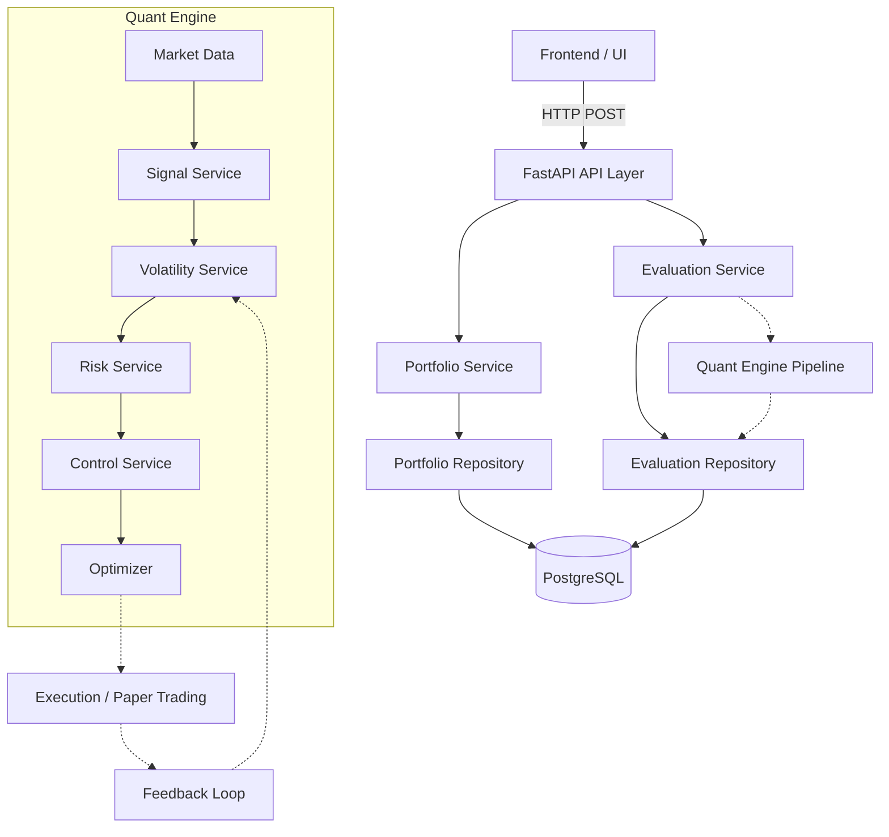

# Veyra Architecture Overview

Veyra is a volatility-driven portfolio management backend. Its primary responsibility is to accept an existing portfolio and determine whether it should hold or rebalance based on volatility regimes and quantitative signals.

## System Architecture

## Layers

1. **API Layer (`backend/api`)**
   - Exposes REST endpoints.
   - Pydantic validation of requests.
   - Converts HTTP errors.
   - *Strictly no business logic.*

2. **Application Services (`backend/services`)**
   - Orchestrates use cases (e.g., evaluating a portfolio).
   - Coordinates domain models, repositories, and the quant engine.

3. **Domain Contracts (`quant_engine/domain.py`)**
   - Pydantic v2 models that form the language of the application.
   - Independent of SQLAlchemy or FastAPI.

4. **Quant Engine (`quant_engine/`)** *(Future Phases)*
   - The differentiated technical layer.
   - Executes market data fetching, GARCH volatility, and optimization.

5. **Repositories (`database/repositories`)**
   - Handles persistence to PostgreSQL via SQLAlchemy.
   - *Strictly no business logic.*

6. **Database (`database/models.py`)**
   - SQLAlchemy 2.x declarative models.
   - Database-level constraints for data integrity.
